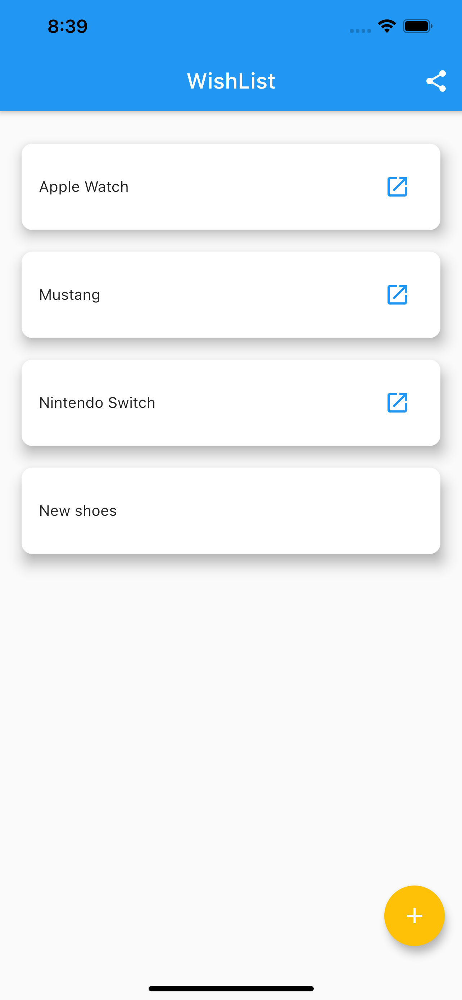

# Flutter Wish app

This is a simple example Flutter application that stores items in the Shared preferences and uses BLoC state management.

## Install
### Step 1:
Download or clone this repo by using the link below:
https://github.com/carlosrzisc/wish_app.git

### Step 2:
Go to project root and execute the following command in console to get the required dependencies:
flutter pub get

## Features
1. Login screen (fake login, you can use testuser/test to access).
2. List the wish list.
3. Add a new wish item to the list.
4. Click on an item to see the details, or click on the launch icon to go the website where the wish item can be found.

## Screenshots

## License
The content of this repository is licensed under a [Apache License, Version 2.0](http://www.apache.org/licenses/LICENSE-2.0)

